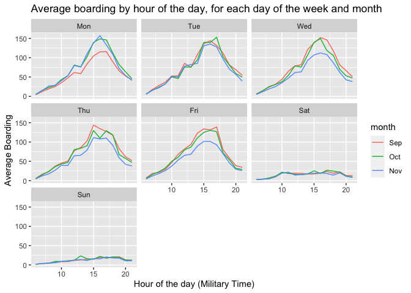
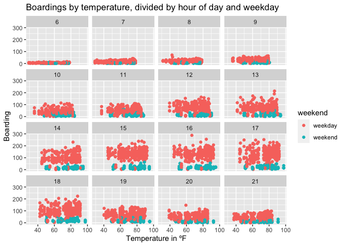
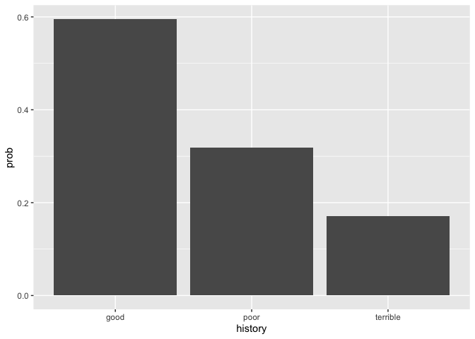
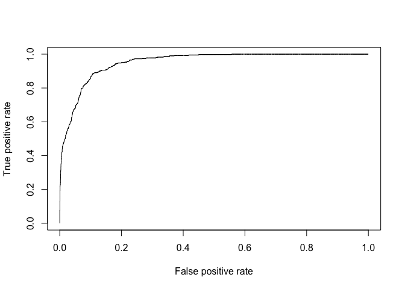

# Homework 2

## Question 1

 We
can see in the graphs that average boarding is higher in weekdays than
weekends and higher on October on average. According to the graphs, the
peak boarding changes slightly during weekdays, the average peak
boarding happens around 16:00 (4:00PM), with Thursday’s peak happening
around 15:00 and the Friday peak happening around 17:00 instead. However
the peak on the weekends happens at different times, on Sundays, the
peak hour is around 13:00-14:00, while on Saturdays there are two very
similar peaks, at 15:00 and 17:00. One of the reason for the smaller
boarding on Monday’s during September could be that there is Labor Day
once a year, where majority of workers and students have a free day, so
they don’t require the bus to attend class or jobs. Thanksgiving happens
during the fourth week of November, therefore employees and students are
usually given Wednesday, Thursday and Friday of vacation during that
week. This lower the average number of boarding during the month of
November.
 Those
graphs show the boarding at a given 15 minute slot depending on the
temperature. It is separated by the hour of the day and whether is a
weekday or a weekend. The results show a much higher boarding during
weekdays, which can be explained by students needing to attend class and
workers needing to attend their jobs. When we hold hour of day and
weekend status constant, we see that a change in temperature has
different effects depending on the hour of the day. In majority of the
hours, change in temperature doesn’t affect the boarding. However,
during the hours of 15-18, a change in temperature will lead to
different boarding. At 15, higher temperatures will lead to more
boarding, while 18, lower temperatures will lead to more boarding.

## Question 2

    ## 
    ## Attaching package: 'modelr'

    ## The following object is masked from 'package:mosaic':
    ## 
    ##     resample

    ## The following object is masked from 'package:ggformula':
    ## 
    ##     na.warn

    ## 
    ## Attaching package: 'caret'

    ## The following object is masked from 'package:mosaic':
    ## 
    ##     dotPlot

    ## The following object is masked from 'package:purrr':
    ## 
    ##     lift

    ## 
    ## Attaching package: 'foreach'

    ## The following objects are masked from 'package:purrr':
    ## 
    ##     accumulate, when

    ##       V1       V2 
    ## 66132.40 61225.09

    ##   result 
    ## 68073.62

    ##   result 
    ## 234951.6

The linear model achieves a lower out-of-sample mean-squared error. When
we choose this model, we choose to regress both models, the linear and
the knn under the same conditions. First we compared the linear model
using simple features of the house and then using more interactions
between the same features. From the model, we can conclude that not only
we must assume a relation between the variables and the price, but
between the variables themselves first and the price. We need to
evaluate the size of the property, the number of rooms, bathrooms and
land value, after that is done we should also realize that for example
the number of rooms in different properties is also relevant, as each
room in a small property will increase the price of the house less than
in a big property, while the living space of a house will decrease the
value of a big property more than a small property. Other things to
consider are that older houses with more bathrooms have higher prices
than newer houses with the same amount of bathrooms or that houses with
big living areas have lower values than houses with small living areas
with same amount of bedrooms. Given all that, we should consider all
relevant interactions before deciding the actual price of the property.

    ## [1] 13

    ## [1] 56

    ##             (Intercept)                 lotSize                     age 
    ##            1.321695e+05           -1.815254e+04           -1.260207e+03 
    ##               landValue              livingArea              pctCollege 
    ##            1.618880e-01            4.290588e+01           -2.714369e+03 
    ##                bedrooms              fireplaces               bathrooms 
    ##           -2.118088e+04            1.041979e+05            4.003988e+03 
    ##                   rooms            centralAirNo             lotSize:age 
    ##            8.799530e+03            2.276161e+04           -2.258833e+02 
    ##       lotSize:landValue      lotSize:livingArea      lotSize:pctCollege 
    ##           -2.365327e-01           -7.147614e+00            6.988159e+02 
    ##        lotSize:bedrooms      lotSize:fireplaces       lotSize:bathrooms 
    ##            5.866264e+03           -3.072667e+03           -7.275084e+03 
    ##           lotSize:rooms    lotSize:centralAirNo           age:landValue 
    ##            2.505801e+03           -5.465592e+03            3.504382e-03 
    ##          age:livingArea          age:pctCollege            age:bedrooms 
    ##            1.478103e-01            1.304823e+01            1.209168e+02 
    ##          age:fireplaces           age:bathrooms               age:rooms 
    ##           -1.664269e+02           -8.840464e+01           -4.014880e+01 
    ##        age:centralAirNo    landValue:livingArea    landValue:pctCollege 
    ##            3.313640e+02           -2.857484e-04            1.885429e-02 
    ##      landValue:bedrooms    landValue:fireplaces     landValue:bathrooms 
    ##           -1.449667e-01           -2.889606e-01            4.290902e-01 
    ##         landValue:rooms  landValue:centralAirNo   livingArea:pctCollege 
    ##           -6.386804e-03            1.418225e-01            5.941350e-01 
    ##     livingArea:bedrooms   livingArea:fireplaces    livingArea:bathrooms 
    ##           -8.944776e+00            2.037167e+01            2.861889e+00 
    ##        livingArea:rooms livingArea:centralAirNo     pctCollege:bedrooms 
    ##            2.969898e+00           -1.165967e+01            4.670690e+02 
    ##   pctCollege:fireplaces    pctCollege:bathrooms        pctCollege:rooms 
    ##           -1.127599e+03            1.825651e+02           -7.488120e+01 
    ## pctCollege:centralAirNo     bedrooms:fireplaces      bedrooms:bathrooms 
    ##           -7.337009e+01           -1.516784e+04            5.955459e+03 
    ##          bedrooms:rooms   bedrooms:centralAirNo    fireplaces:bathrooms 
    ##           -8.172355e+02            4.721231e+03           -8.806100e+03 
    ##        fireplaces:rooms fireplaces:centralAirNo         bathrooms:rooms 
    ##           -3.313349e+02            7.126804e+03           -1.622685e+03 
    ##  bathrooms:centralAirNo      rooms:centralAirNo 
    ##           -1.216157e+04           -2.278952e+03

## Question 3

    ##         (Intercept)            duration              amount         installment 
    ##               -0.71                0.03                0.00                0.22 
    ##                 age         historypoor     historyterrible          purposeedu 
    ##               -0.02               -1.11               -1.88                0.72 
    ## purposegoods/repair       purposenewcar      purposeusedcar       foreigngerman 
    ##                0.10                0.85               -0.80               -1.26

When we plot the default probability, we found that there is higher
probability of defaulting when you have a good credit history,
furthermore when we produce a logit regression, we found the same
results. For us that is unusual, as usually a person with a good credit
history would be less likely to default any loan, as there is history of
making payments on time, while we should expect the poor and terrible
credit history to have higher positive impact on the probability of
default, instead we find the opposite. We think that this data set isn’t
good to screen prospective borrowers, because although the data tells us
that good credit history usually leads to higher probabilities of
default, we see that in the “real world”, it’s the opposite, those with
good credit history are known for paying their bills on time, not
letting due dates pass and being ideal borrowers as the guarantee of
return is higher. We believe that the biggest problem was that the data
was collected retrospectively, so at the moment they were creating this
data set, it’s possible that some of the borrowers that are now
classified as “good” were classified as “poor” at the moment they had
this loan with the bank, we can also argue that due to less than 20% of
the observations being “good” credit history, the effect of one default
in this group is higher than in other groups, because it makes the
average change higher.

## Question 4

    ## [1] 0.2618266

    ## [1] 0.2285849

    ## [1] 0.2282182

    ## [1] 49

    ## [1] 836

# B

    ##    Predicted Children Number of Children Difference
    ## 1          20.0472700         28.0000000 -7.9527260
    ## 2          18.9673500         18.0000000  0.9673483
    ## 3          19.0572500         15.0000000  4.0572460
    ## 4          24.4683100         23.0000000  0.4683070
    ## 5          17.5819100         19.0000000 -1.4180940
    ## 6          15.0624800         16.0000000 -0.9375197
    ## 7          19.3911600         24.0000000 -4.6088400
    ## 8          18.7511500         15.0000000  3.7511510
    ## 9          22.5065100         23.0000000 -0.4934916
    ## 10         14.6024700         11.0000000  3.6024750
    ## 11         20.0126600         21.0000000 -0.9873403
    ## 12         20.9443000         18.0000000  2.9442990
    ## 13         24.9379100         21.0000000  3.9379110
    ## 14         21.6297200         23.0000000 -1.3702770
    ## 15         23.4635600         24.0000000 -0.5364365
    ## 16         19.2002200         24.0000000 -4.7997850
    ## 17         21.3721900         20.0000000  1.3721880
    ## 18         22.8485500         26.0000000 -3.1514470
    ## 19         19.2772300         16.0000000  3.2772340
    ## 20         17.8778000         17.0000000  0.8777976
