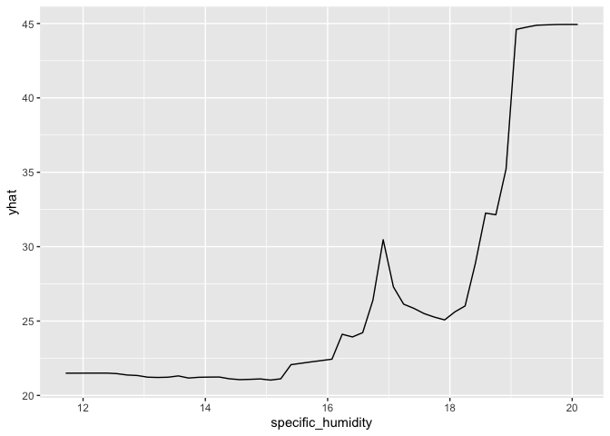
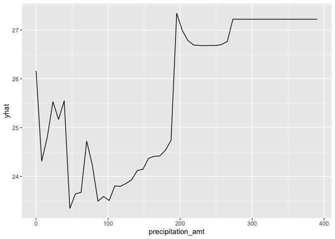
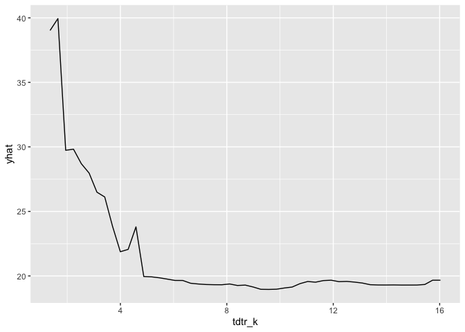
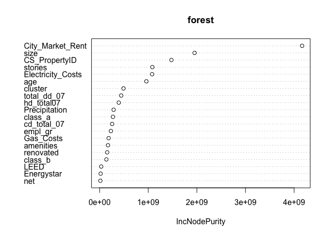
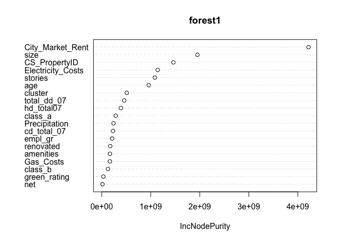
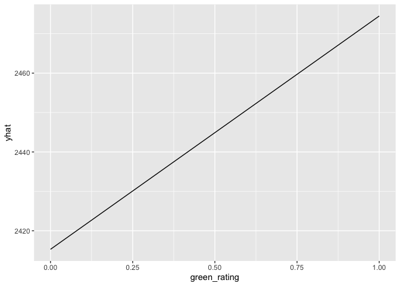
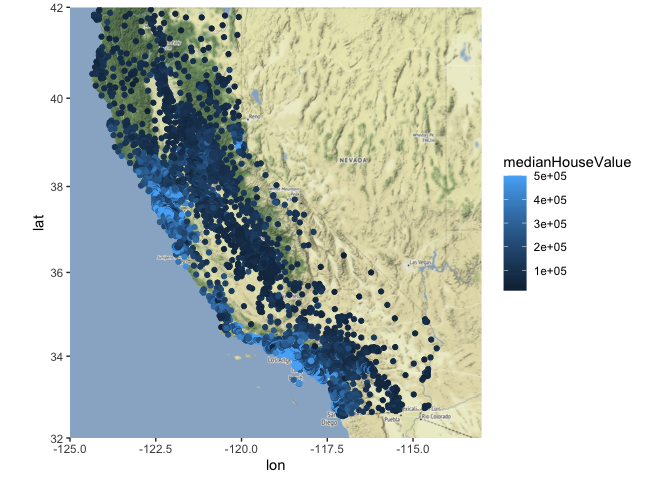
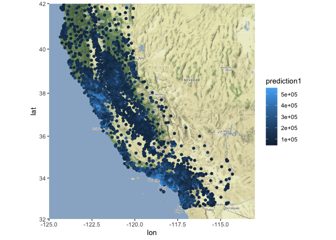
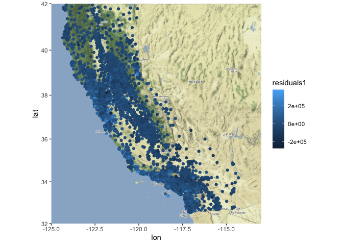

## Question 1 - What causes what?

### 1 - Why can’t I just get data from a few different cities and run the regression of “Crime” on “Police” to understand how more cops in the streets affect crime? (“Crime” refers to some measure of crime rate and “Police” measures the number of cops in a city.)

You can’t simply run a regression of “Crime” on “Police”, because it’s
ambiguous whether more cops on the streets will lead to higher crime
rates or if higher crime rates will lead to more cops on the streets.
The variables will probably be very positively correlated.

### 2 - How were the researchers from UPenn able to isolate this effect? Briefly describe their approach and discuss their result in the “Table 2” below, from the researchers’ paper.

The researchers at UPENN decided to gather data on crime from DC and
whether the day correlated with each observation was a high alert day or
not. By law, there must always be more cops on the streets on high alert
days, so it eliminates the idea that more crime would create more cops
on this data. From that, they found that days on high alert, or in other
words, days with more cops there is less crime in the city, so they were
able to conclude the decrease, more specifically 7.316 cases in crime by
the presence of of more police.

### 3 - Why did they have to control for Metro ridership? What was that trying to capture?

There is the assumption that when less people are riding the metro,
there are less chances of a crime happening, as there are less people on
the streets. So when they choose to control for METRO ridership they are
trying to establish the effect of more police on crime while removing
possible bias from less people on the streets on those high alert days.

### 4 - Below I am showing you “Table 4” from the researchers’ paper. Just focus on the first column of the table. Can you describe the model being estimated here? What is the conclusion?

They estimate crime rates on two interactions and controlling for METRO
ridership. They choose to interact the high alert and District 1, as
well as high alert and Other Districts. With those interactions they are
testing for the effect of high alert in different areas. We can see that
in District 1, where the US Capitol, Chinatown, the downtown business
district, etc. are located, the high alert day have a stronger negative
effect on crime, which makes sense, given that the best targets would be
in this area, so the mayor would deploy more cops in there than in other
districts. The second value is not statistically significant, so we
cannot say that the effect of the high alert on crime in the other
districts is different than 0.

## Question 2 - Tree modeling: dengue cases

We predicted the dengue cases with three different models, we used the
CART, random forest and gradient boosted forest. For the variables of
the prediction, we used the city, the season, the specific humidity, the
precipitation of the week and the average diurnal temperature range.
With the models created, we estimated the RMSE for the models, with the
results in the following table:

    ##       CART  forests gradient_boosted
    ## 1 36.91022 33.74568         35.08071

Given that the random forest model had the smallest RMSE, we used this
model for the following dependence plots, where we show the total cases
predicted on average when the chosen variable change.

This line graph shows that this model will predict higher cases for
humidity above 19, while it will also predict more cases for humidity of
17 than any lower value.

This line graph shows that precipitations higher than 200 ml per week
will lead to a prediction of more cases than smaller precipitations,
however we can see that the mimimum prediction of cases is 23.5, while
the maximum is approximately 27. We can say that there is very little
variation of cases predicted by the precipitation.

This line graph shows that the model predicts higher dengue cases when
temperature varies very little and it predicts less as the daily
temperature variation increases. It makes sense, as we assume hot days
in Peru and Puerto Rico don’t vary in temperature a lot throughout the
day, so it is more favorable for the dengue mosquito to live.

## Question 3 - Predictive model building: green certification

### Methods

For this report, our goal was to detect the change in rent on houses
with green certificate, such that an architect would choose to contruct
if there is more revenue to be made when renting a “green” house. To
create a predictive model, we decided to create a variable for the
rental income per square foot, which was the average rent per square
foot multiplied by the percentage of occupancy of the house. After that,
we had to define whether it was more relevant to include the variables
for green rating as two separate controls or whether to remove those
variables and use the general “green\_rating” variable. To do so, we ran
two different random forests, one with both variables and one with the
general variable only.

With those graphs, we could see that there was no real difference
between which set of variables to use, so we decided to create four
different predictive models using the general green rating instead of
the two separated ones.

<table>
<caption>Table with prediction model’s RMSE</caption>
<thead>
<tr class="header">
<th style="text-align: left;"></th>
<th style="text-align: left;">RMSE</th>
</tr>
</thead>
<tbody>
<tr class="odd">
<td style="text-align: left;">Random Forest</td>
<td style="text-align: left;">708.0118</td>
</tr>
<tr class="even">
<td style="text-align: left;">Boosted Forest</td>
<td style="text-align: left;">889.6841</td>
</tr>
<tr class="odd">
<td style="text-align: left;">Medium Model</td>
<td style="text-align: left;">983.2343</td>
</tr>
<tr class="even">
<td style="text-align: left;">Large Model</td>
<td style="text-align: left;">974.8417</td>
</tr>
</tbody>
</table>

Table with prediction model’s RMSE

The results, which are shown on the above table, lead us to use the
random forest model to predict the rental income per square foot, as it
had the smallest RMSE.

### Conclusion

After predicting the value with our model, we decided to graph the
average rental income per square foot associated with the green
certificate. The graph shows that there is on average approximately
$55-65 difference between having a green certificate or not. That means
it is not very significant on the rental income the house having a green
certificate.

## Question 4 - Predictive model building: California housing

When we were creating a predictive model, we first thought about what
variables to include in the model, whether we wanted to use them all or
not. In addition to that we had to decided whether to use average or
total values for some of the variables, given that rooms, people and
bedrooms were given for the total of the area, so we decided that we
wanted to check if it was more relevant to use a total or an average per
household in the same area. To do so, we conducted the same medium and
large regressions, as well as random forests and gradient-boosted
forests to check for the smallest RMSE.

<table>
<caption>Table with prediction model’s RMSE</caption>
<thead>
<tr class="header">
<th style="text-align: left;"></th>
<th style="text-align: left;">RMSE</th>
</tr>
</thead>
<tbody>
<tr class="odd">
<td style="text-align: left;">RandomForest - Mean</td>
<td style="text-align: left;">70615.98</td>
</tr>
<tr class="even">
<td style="text-align: left;">RandomForest - Total</td>
<td style="text-align: left;">72519.08</td>
</tr>
<tr class="odd">
<td style="text-align: left;">Boosted - Mean</td>
<td style="text-align: left;">70237.38</td>
</tr>
<tr class="even">
<td style="text-align: left;">Boosted - Total</td>
<td style="text-align: left;">72254.21</td>
</tr>
<tr class="odd">
<td style="text-align: left;">Medium - Mean</td>
<td style="text-align: left;">120789.41</td>
</tr>
<tr class="even">
<td style="text-align: left;">Medium - Total</td>
<td style="text-align: left;">78665.65</td>
</tr>
<tr class="odd">
<td style="text-align: left;">Large - Mean</td>
<td style="text-align: left;">299485.00</td>
</tr>
<tr class="even">
<td style="text-align: left;">Large - Total</td>
<td style="text-align: left;">77572.42</td>
</tr>
</tbody>
</table>

Table with prediction model’s RMSE

The results of the table showed us that the lowest RMSE was from the
gradient-boosted forest with the average of some of the variables. So we
use it to predict the median house value of the houses in California and
we subtracted those predictions from the actual values to get the errors
of the model.

In this graph, we see the actual median house value for different areas
of California.

This graph shows the predictions of median house values made by our
gradient-boosted forest model for houses across different areas of
California.

This last graph is the errors of our predictive model, in each area of
California, it shows how close to the actual value our prediction was.
