# Question 1 - Clustering and PCA

First, let’s have a look at the summary of the data.

    ##  fixed.acidity    volatile.acidity  citric.acid     residual.sugar  
    ##  Min.   : 3.800   Min.   :0.0800   Min.   :0.0000   Min.   : 0.600  
    ##  1st Qu.: 6.400   1st Qu.:0.2300   1st Qu.:0.2500   1st Qu.: 1.800  
    ##  Median : 7.000   Median :0.2900   Median :0.3100   Median : 3.000  
    ##  Mean   : 7.215   Mean   :0.3397   Mean   :0.3186   Mean   : 5.443  
    ##  3rd Qu.: 7.700   3rd Qu.:0.4000   3rd Qu.:0.3900   3rd Qu.: 8.100  
    ##  Max.   :15.900   Max.   :1.5800   Max.   :1.6600   Max.   :65.800  
    ##    chlorides       free.sulfur.dioxide total.sulfur.dioxide    density      
    ##  Min.   :0.00900   Min.   :  1.00      Min.   :  6.0        Min.   :0.9871  
    ##  1st Qu.:0.03800   1st Qu.: 17.00      1st Qu.: 77.0        1st Qu.:0.9923  
    ##  Median :0.04700   Median : 29.00      Median :118.0        Median :0.9949  
    ##  Mean   :0.05603   Mean   : 30.53      Mean   :115.7        Mean   :0.9947  
    ##  3rd Qu.:0.06500   3rd Qu.: 41.00      3rd Qu.:156.0        3rd Qu.:0.9970  
    ##  Max.   :0.61100   Max.   :289.00      Max.   :440.0        Max.   :1.0390  
    ##        pH          sulphates         alcohol         quality     
    ##  Min.   :2.720   Min.   :0.2200   Min.   : 8.00   Min.   :3.000  
    ##  1st Qu.:3.110   1st Qu.:0.4300   1st Qu.: 9.50   1st Qu.:5.000  
    ##  Median :3.210   Median :0.5100   Median :10.30   Median :6.000  
    ##  Mean   :3.219   Mean   :0.5313   Mean   :10.49   Mean   :5.818  
    ##  3rd Qu.:3.320   3rd Qu.:0.6000   3rd Qu.:11.30   3rd Qu.:6.000  
    ##  Max.   :4.010   Max.   :2.0000   Max.   :14.90   Max.   :9.000  
    ##     color          
    ##  Length:6497       
    ##  Class :character  
    ##  Mode  :character  
    ##                    
    ##                    
    ## 

\#\#Let’s start with clustring

Now we create 2 clusters using K-means.

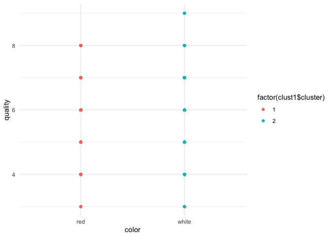

As we can notice, the algorithm succeeded in differentiating between the
wine colors.

Out of curiosity, let’s have a look at the distribution of quality for
each wine color.

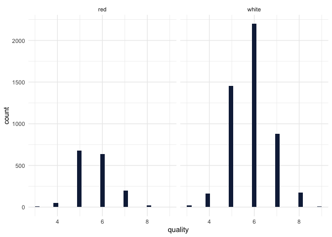

White wines have higher frequency in quality that is higher than 7. That
is relatively reflected in the clustered graph by having a point when
quality = 9. However, we don’t see that in the red whine. Also, there
are no points for both wines when quality is lower than 3 which matches
the distribution of the quality variable. So, we can say that the
clustering satisfies the differentiating between red and white wines
including their qualities.

We have tried K = different values, but it failed to answer what is
asked in the question. Therefore, we believe 2 clusters is an option
that satisfies the this part.

However, let’s see if can improve the in-sample fit by doing K-means++.

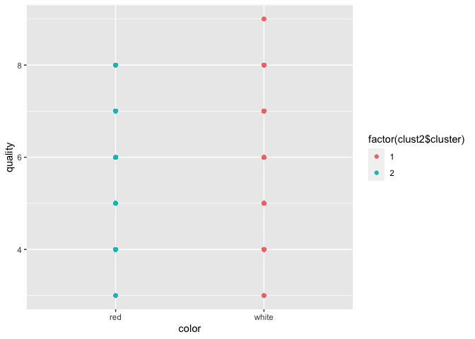

We got the same graph, but let’s check the cluster sum of errors to
double check.

There was no improvement when we did the K-means++. So the k-means
itself was sufficient.

\#\#Now let’s work on PCA…

**From the results, we can notice that PC2 explains 50% of the
variations, and PC6 explains 85% as cumulative.**

Let’s first work on PCA1 and PCA2.

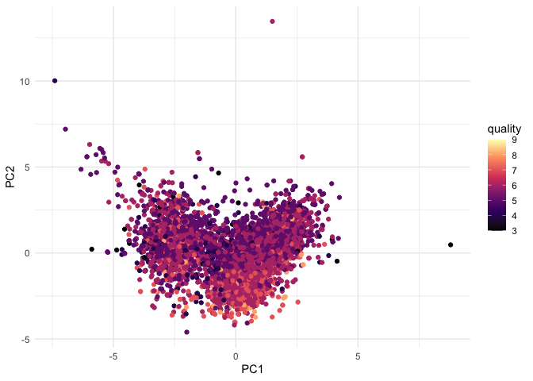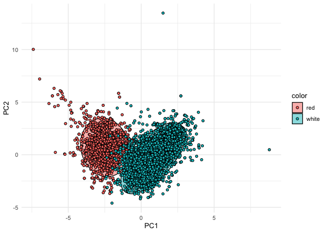

PCA1 and PCA2 were able to distinguish between red wines and white
wines. There are some blue points lay in the red circle, that’s because
their chemical properties must be very close to each others. However, in
general the algorithm succeed in differentiating the colors. In terms of
quality, it seems the higher quality wines are the points below 0 for
PCA2 and above 0 for PCA1 in general. However, let’s understand how PCA1
and 2 are formed.

*Note: We have tried the other PCAs, but it seems like PCA1 and PCA2 is
better at differentiating the colors and quality.*

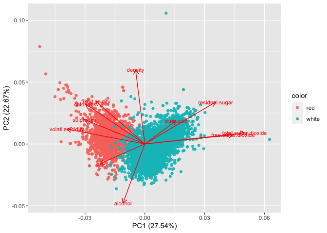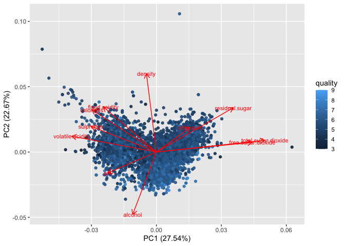

From the graph above we can know that quality is negatively correlated
with density, fixed acidity, chlorides. On the other hand, it is
positively correlated with alcohol.

**So we can conclude that the unsupervised algorithm used was relatively
able to distinguish between red and white wines, and between their
qualities. There are margin of errors, but the results still could be
interpreted. **

# Question 2 - Market segmentation

To analyze it, we didn’t want to consider spam accounts in our analysis
so we start by removing any observations that have non-zero values in
the categories for adult and spam. After that we decided to see what
kinds of tweets happen most ofter for the followers of the NutrientH20
brand. After ranking the tweets, we can see that chatter, photo sharing
and health & nutrition are the most shared, but we should try to find
common interests between followers of our account.

    ## Warning in stats::cor(x, y, ...): o desvio padrão é zero

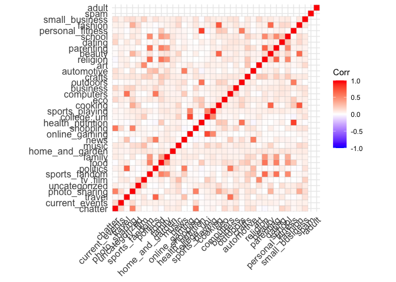

Using a heat map allows us to see which topic combinations are popular
among followers. We want to define the market segment as common
interests among users, but we also want to ensure that these common
interests reflect a significant share of users. We can see that users
who post about personal fitness also frequently post about health and
nutrition. College and online gaming are highly correlated. This gives
us an idea of which themes to present in our advertising that will peak
interests.We want brand messaging to reflect the interests of our market
segment. If we run PCA we can get an idea of which topics are popular
within user groups, and the size of the market segment under different
branding schemes. So we decided to create 6 different PCAs, because any
number higher would lead to PCAs with non significant observations.

    ##                   PC1   PC2   PC3   PC4   PC5   PC6
    ## chatter          0.07 -0.62  0.20 -0.30  0.42 -0.03
    ## current_events   0.02 -0.06 -0.01 -0.02  0.01 -0.02
    ## travel           0.01 -0.11 -0.41 -0.12 -0.07  0.16
    ## photo_sharing    0.12 -0.48  0.16 -0.05 -0.03  0.03
    ## uncategorized    0.02 -0.03  0.00  0.02 -0.01  0.00
    ## tv_film          0.01 -0.03 -0.06  0.06  0.03 -0.01
    ## sports_fandom    0.02 -0.06 -0.15  0.01 -0.05 -0.56
    ## politics         0.00 -0.17 -0.66 -0.26 -0.10  0.21
    ## food             0.09 -0.01 -0.12  0.02 -0.01 -0.38
    ## family           0.02 -0.04 -0.04  0.02 -0.01 -0.18
    ## home_and_garden  0.01 -0.02 -0.02  0.00  0.00 -0.02
    ## music            0.02 -0.05  0.00  0.03 -0.01 -0.01
    ## news             0.01 -0.06 -0.34 -0.12 -0.06  0.02
    ## online_gaming    0.01 -0.12 -0.18  0.55  0.27  0.06
    ## shopping         0.05 -0.25  0.08 -0.10  0.11 -0.01
    ## health_nutrition 0.81  0.26 -0.04 -0.08  0.22  0.04
    ## college_uni      0.00 -0.17 -0.21  0.61  0.30  0.07
    ## sports_playing   0.02 -0.05 -0.05  0.12  0.05  0.00
    ## cooking          0.33 -0.27  0.12  0.26 -0.65  0.12
    ## eco              0.04 -0.03 -0.01 -0.01  0.02 -0.02
    ## computers        0.02 -0.06 -0.17 -0.06 -0.03  0.04
    ## business         0.01 -0.04 -0.02 -0.01  0.00  0.00
    ## outdoors         0.14  0.03 -0.04 -0.01  0.02 -0.01
    ## crafts           0.02 -0.03 -0.02  0.00  0.00 -0.06
    ## automotive       0.00 -0.07 -0.10 -0.04  0.00 -0.05
    ## art              0.02 -0.02 -0.04  0.05  0.00 -0.02
    ## religion         0.03 -0.04 -0.11  0.03 -0.06 -0.48
    ## beauty           0.06 -0.11  0.03  0.08 -0.22 -0.03
    ## parenting        0.03 -0.04 -0.08  0.01 -0.04 -0.35
    ## dating           0.04 -0.06 -0.03 -0.03  0.03 -0.02
    ## school           0.02 -0.06 -0.04  0.00 -0.03 -0.22
    ## personal_fitness 0.39  0.10 -0.02 -0.04  0.10  0.00
    ## fashion          0.09 -0.17  0.06  0.12 -0.30  0.03
    ## small_business   0.01 -0.03 -0.02  0.00  0.00  0.00
    ## spam             0.00  0.00  0.00  0.00  0.00  0.00
    ## adult            0.00  0.00  0.00  0.00  0.00  0.00

When we summarize the results of each PCA, we get general results of
what kind of tweet would be part of each.

    ##              Social         PC1
    ## 1  health_nutrition 0.813874095
    ## 2  personal_fitness 0.391337262
    ## 3           cooking 0.332037416
    ## 4          outdoors 0.144819569
    ## 5     photo_sharing 0.124007943
    ## 6              food 0.094220807
    ## 7           fashion 0.093194466
    ## 8           chatter 0.073069044
    ## 9            beauty 0.058316795
    ## 10         shopping 0.049073174
    ## 11              eco 0.038944753
    ## 12           dating 0.038452599
    ## 13        parenting 0.028037677
    ## 14         religion 0.025745734
    ## 15    uncategorized 0.024406568
    ## 16            music 0.023683266
    ## 17           crafts 0.021276519
    ## 18           school 0.020517621
    ## 19              art 0.020002087
    ## 20    sports_fandom 0.019215709
    ## 21           family 0.017597259
    ## 22   sports_playing 0.016552402
    ## 23   current_events 0.015570092
    ## 24        computers 0.015214047
    ## 25             news 0.014602440
    ## 26  home_and_garden 0.013578422
    ## 27         business 0.013130403
    ## 28    online_gaming 0.013086096
    ## 29           travel 0.006619824
    ## 30   small_business 0.005056511
    ## 31          tv_film 0.005031452
    ## 32       automotive 0.003570129
    ## 33         politics 0.001575713
    ## 34      college_uni 0.001072991
    ## 35             spam 0.000000000
    ## 36            adult 0.000000000

Within group one we can see that health & nutrition ranks first which is
right on with our imaging of the brand. This shows that this interest is
the popular among this group. The second largest is personal fitness. We
still need to check other groups to ensure we are capturing a
significant portion of followers.

    ##              Social         PC2
    ## 1  health_nutrition  0.25564815
    ## 2  personal_fitness  0.09681530
    ## 3          outdoors  0.03358575
    ## 4              spam  0.00000000
    ## 5             adult  0.00000000
    ## 6              food -0.01076173
    ## 7   home_and_garden -0.01962492
    ## 8               art -0.02476041
    ## 9               eco -0.02600668
    ## 10    uncategorized -0.02727046
    ## 11   small_business -0.02907339
    ## 12           crafts -0.02926743
    ## 13          tv_film -0.03311090
    ## 14         religion -0.03536635
    ## 15         business -0.03832558
    ## 16        parenting -0.03850098
    ## 17           family -0.04314441
    ## 18            music -0.04575020
    ## 19   sports_playing -0.04733730
    ## 20           school -0.05599124
    ## 21    sports_fandom -0.05703516
    ## 22   current_events -0.05756444
    ## 23             news -0.06027993
    ## 24        computers -0.06208986
    ## 25           dating -0.06351437
    ## 26       automotive -0.06835322
    ## 27           travel -0.10518518
    ## 28           beauty -0.11098869
    ## 29    online_gaming -0.11835156
    ## 30      college_uni -0.16680904
    ## 31         politics -0.16889188
    ## 32          fashion -0.17421062
    ## 33         shopping -0.25327578
    ## 34          cooking -0.27226473
    ## 35    photo_sharing -0.48421705
    ## 36          chatter -0.62103552

Once again health & nutrition and personal fitness are the top
categories. The first and second group represent ~33% of followers.

    ##              Social           PC3
    ## 1           chatter  0.1974255497
    ## 2     photo_sharing  0.1598533225
    ## 3           cooking  0.1191960872
    ## 4          shopping  0.0819459130
    ## 5           fashion  0.0596051994
    ## 6            beauty  0.0337880780
    ## 7     uncategorized  0.0007943897
    ## 8              spam  0.0000000000
    ## 9             adult  0.0000000000
    ## 10            music -0.0046728921
    ## 11              eco -0.0098883219
    ## 12   current_events -0.0105567451
    ## 13  home_and_garden -0.0154176343
    ## 14   small_business -0.0168881190
    ## 15         business -0.0202965802
    ## 16 personal_fitness -0.0208544891
    ## 17           crafts -0.0227578986
    ## 18           dating -0.0345690112
    ## 19           school -0.0353122068
    ## 20         outdoors -0.0390685445
    ## 21 health_nutrition -0.0392234366
    ## 22              art -0.0431306458
    ## 23           family -0.0448165244
    ## 24   sports_playing -0.0477617420
    ## 25          tv_film -0.0582378190
    ## 26        parenting -0.0815059924
    ## 27       automotive -0.1048339712
    ## 28         religion -0.1089671485
    ## 29             food -0.1179628009
    ## 30    sports_fandom -0.1467227678
    ## 31        computers -0.1650208282
    ## 32    online_gaming -0.1780498136
    ## 33      college_uni -0.2101554467
    ## 34             news -0.3356049625
    ## 35           travel -0.4146900737
    ## 36         politics -0.6633532535

This group prefers chatter and photo sharing. This indicates that an ad
with a visual element could be beneficial. Interestingly they aren’t
positive when it comes to H&N and personal fitness.

    ##              Social           PC4
    ## 1       college_uni  0.6099716159
    ## 2     online_gaming  0.5513008883
    ## 3           cooking  0.2601927202
    ## 4           fashion  0.1244182970
    ## 5    sports_playing  0.1203876576
    ## 6            beauty  0.0783589375
    ## 7           tv_film  0.0591651098
    ## 8               art  0.0485687222
    ## 9             music  0.0349453248
    ## 10         religion  0.0289879795
    ## 11    uncategorized  0.0207331305
    ## 12             food  0.0201467991
    ## 13           family  0.0153205701
    ## 14    sports_fandom  0.0121219429
    ## 15        parenting  0.0118811463
    ## 16   small_business  0.0049576431
    ## 17  home_and_garden  0.0043729928
    ## 18           crafts  0.0012775848
    ## 19             spam  0.0000000000
    ## 20            adult  0.0000000000
    ## 21           school -0.0009606505
    ## 22              eco -0.0085851149
    ## 23         business -0.0096848021
    ## 24         outdoors -0.0145354382
    ## 25   current_events -0.0169565857
    ## 26           dating -0.0272933839
    ## 27 personal_fitness -0.0379683150
    ## 28       automotive -0.0384852044
    ## 29    photo_sharing -0.0463637555
    ## 30        computers -0.0567048301
    ## 31 health_nutrition -0.0779703993
    ## 32         shopping -0.0983451307
    ## 33             news -0.1166183800
    ## 34           travel -0.1206105162
    ## 35         politics -0.2594861725
    ## 36          chatter -0.2998879795

This group prefers posting about college and online gaming. While school
and eco are negatively associated. H&N and personal fitness posts are
not associated with this group.

    ##              Social           PC5
    ## 1           chatter  0.4171715539
    ## 2       college_uni  0.3009629558
    ## 3     online_gaming  0.2698055376
    ## 4  health_nutrition  0.2212605985
    ## 5          shopping  0.1103560174
    ## 6  personal_fitness  0.1048980187
    ## 7    sports_playing  0.0461537239
    ## 8            dating  0.0308076159
    ## 9           tv_film  0.0273565163
    ## 10         outdoors  0.0226106708
    ## 11              eco  0.0159869199
    ## 12   current_events  0.0107132559
    ## 13           crafts  0.0018751211
    ## 14   small_business  0.0002371624
    ## 15             spam  0.0000000000
    ## 16            adult  0.0000000000
    ## 17  home_and_garden -0.0002579737
    ## 18         business -0.0007707896
    ## 19       automotive -0.0021072555
    ## 20              art -0.0026551977
    ## 21           family -0.0068805596
    ## 22             food -0.0101390916
    ## 23    uncategorized -0.0109124344
    ## 24            music -0.0132592213
    ## 25           school -0.0306721450
    ## 26    photo_sharing -0.0308124389
    ## 27        computers -0.0342547534
    ## 28        parenting -0.0417765148
    ## 29    sports_fandom -0.0498239361
    ## 30         religion -0.0596138909
    ## 31             news -0.0621691774
    ## 32           travel -0.0749012483
    ## 33         politics -0.0998523901
    ## 34           beauty -0.2163374556
    ## 35          fashion -0.3024582545
    ## 36          cooking -0.6455324736

Health & nutrition and personal fitness are positively associated with
this group. So are sports.

    ##              Social           PC6
    ## 1          politics  0.2125860690
    ## 2            travel  0.1586173917
    ## 3           cooking  0.1205995371
    ## 4       college_uni  0.0706939841
    ## 5     online_gaming  0.0607754866
    ## 6  health_nutrition  0.0426971310
    ## 7         computers  0.0422140960
    ## 8     photo_sharing  0.0326827097
    ## 9           fashion  0.0280178086
    ## 10             news  0.0186007636
    ## 11    uncategorized  0.0035411712
    ## 12 personal_fitness  0.0011614000
    ## 13             spam  0.0000000000
    ## 14            adult  0.0000000000
    ## 15   sports_playing -0.0006351358
    ## 16   small_business -0.0042106146
    ## 17         business -0.0042721240
    ## 18         outdoors -0.0055476680
    ## 19            music -0.0095805276
    ## 20         shopping -0.0106444093
    ## 21          tv_film -0.0137153137
    ## 22           dating -0.0168044148
    ## 23  home_and_garden -0.0172310134
    ## 24              art -0.0174962432
    ## 25              eco -0.0195771522
    ## 26   current_events -0.0224500589
    ## 27          chatter -0.0257143895
    ## 28           beauty -0.0282055624
    ## 29       automotive -0.0464453034
    ## 30           crafts -0.0588268916
    ## 31           family -0.1788962086
    ## 32           school -0.2194386298
    ## 33        parenting -0.3515833043
    ## 34             food -0.3769136674
    ## 35         religion -0.4811781109
    ## 36    sports_fandom -0.5602875683

Health & nutrition and personal fitness are positively associated with
this group.

After examining the groups created in our PCA we recommend positioning
the product to reflect drink as a healthy option that is great for
rehydrating after a workout. The company can expect this to align with
roughly half of their account followers. This market segment likely
participates in physical activities like working out or sports, and are
looking for healthy drinks instead of sodas. The brand should position
itself to be the premier choice for this market segment.

# Question 3 - Finish Graph separately

This dataset was composed of the basket of goods of 9835 customers. To
create the network we decided to use a confidence of at least 5 percent,
support of at least 1 percent and max lenght of 4. We wanted to see what
products were purchased at least 5 percent in relation to other product
and 1 percent by itself and see a maximum of four items that this good
relates to. However, we found many rules that were not very significant,
so when we graph it, we decided to maintain only rules that double the
chance of purchasing the second item when the first was already on the
basket.

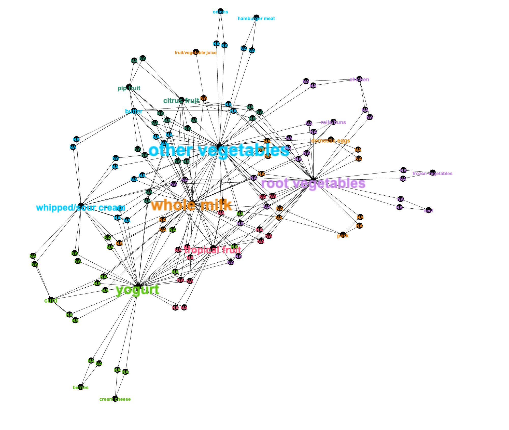

In this graph we see that there are less rules that double the purchase
probability. We can see some meaninful relation between yougurt and
berries. But we also see some weird relations, as whipped cream and
other vegetables.

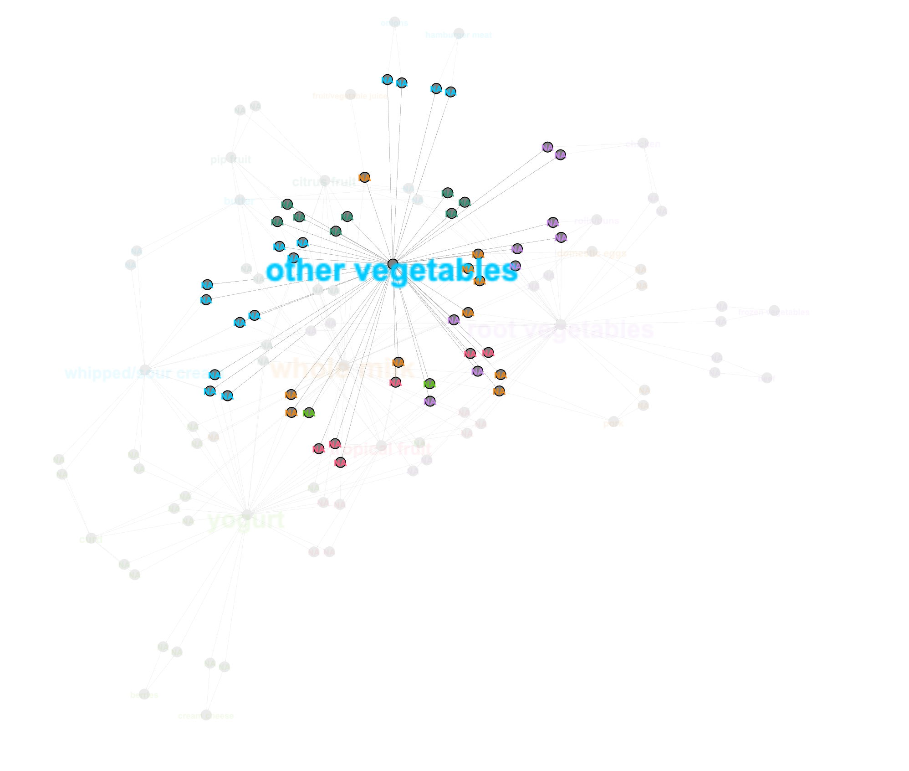

To see some relations better, we decided to check two nodes, which were
“other vegetables” and “root vegetables”. We can see that “other
vegetables” not only relate to other products of their cluster, but also
to many different products varying from all clusters. One can argue that
“other vegetables” are purchased by majority of the customers in our
dataset and that they have increased probability of being purchased in
relation to a phetora of items.

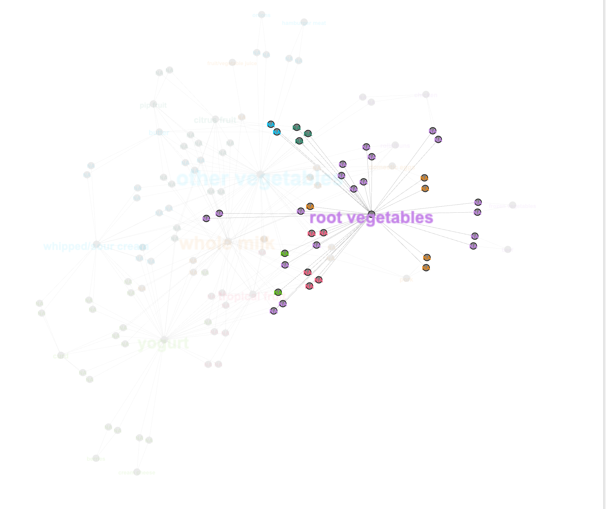

As for the “root vegetables”, we see the relation whithin it’s own
cluster, but we see some relation with other clusters, but not as many
as the previous node. We can see in this node one problem from this
dataset, which is that it separates some items into multiple categories.
“Onions” are an item classified in the “other vegetable”, but they are
also “root vegetables”, so we would expect them to be closely related.
Using this network, a supermarket has two options, it can keep related
items located closely to each other, so that the customer will acquire
both, or knowing that some have high purchase relation, it can keep them
apart, which will make the customer transite through the store for
longer and possible purchase other items with smaller confidence.
